# Clonezilla Steps

##### **Requirements:**

- **USB Drive, 500MB or more (Everything on it will be erased)**
- **2 Drives**

**In this tutorial, I will be cloning a 20GB drive to a 30GB drive**

---

##### **1. Setting Up the USB Drive**

**a. Download the latest [Rufus release here](https://rufus.ie/en/)**

**[https://rufus.ie/en/](https://rufus.ie/en/)**

**[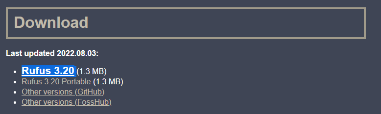](2022-11/image.png)**

Save it anywhere **except the USB drive**

**[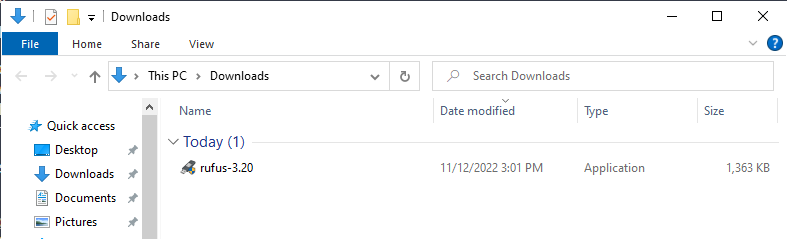](2022-11/D2Ximage.png)**

**b. Download the latest [Clonezilla release here](https://clonezilla.org/downloads/download.php?branch=stable)**

Change file type to **ISO** and press **Download**

**[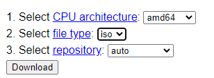](2022-11/5CNimage.png)**

Once it's done downloading, it should look like this

**[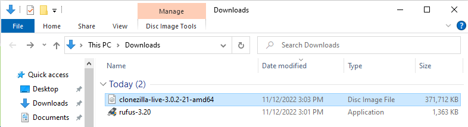](2022-11/izpimage.png)**

**c. Open Rufus**

Press **No** if it asks to check for updates

**[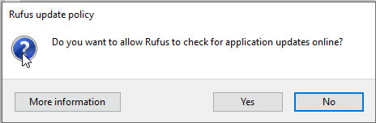](2022-11/ZzIimage.png)**

You should see this menu

**[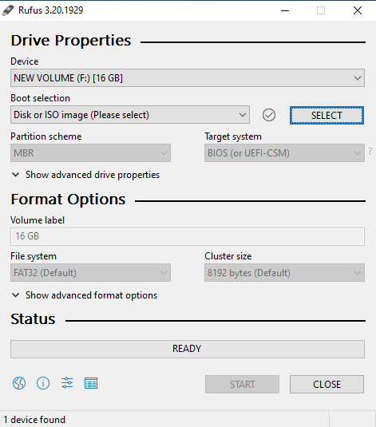](2022-11/To3image.png)**

Press the blue **SELECT** button on the right and select the Clonezilla ISO that you downloaded

**[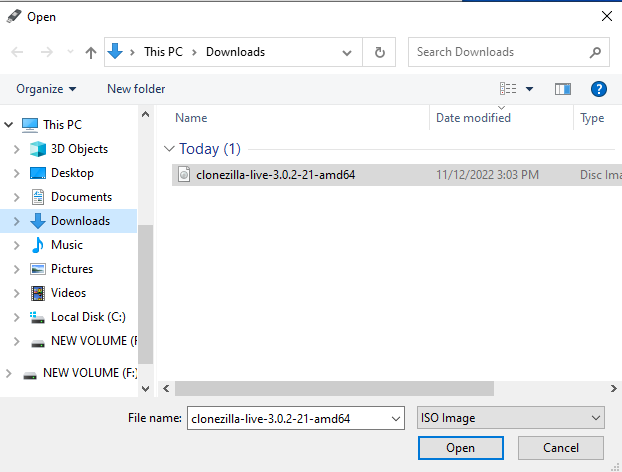](2022-11/n1eimage.png)**

Rufus should now look like this, it may be different but it doesn't matter. Just use the defaults.

**[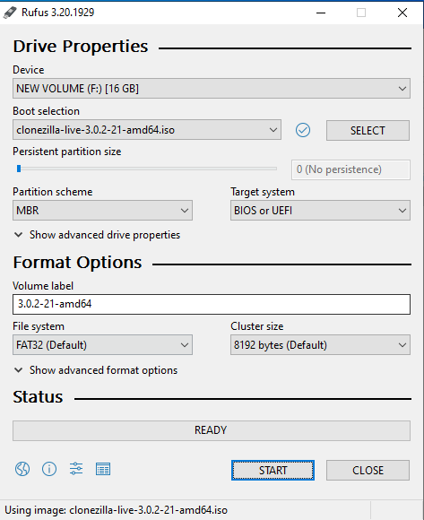](2022-11/ibHimage.png)**

Press the blue **START** button on the bottom
!!! note "Note"
    If it says **ISOHybrid image detected**, just press the blue **OK** button

**[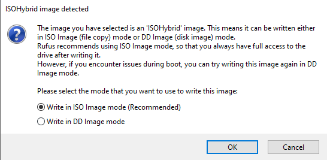](2022-11/K22image.png)**

!!! note "Note"
    If it says **Download required**, press the blue **Yes** button

**[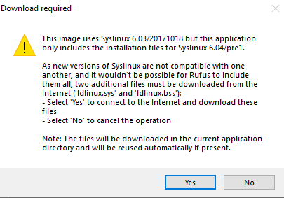](2022-11/1nuimage.png)**

Rufus will tell you everything on the USB drive will be deleted, press the blue **OK** button

!!! Danger "WARNING"
    **Make sure there is nothing important on the USB drive**

**[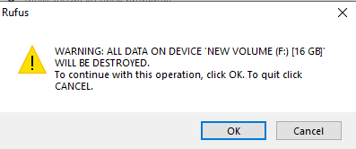](2022-11/Gtdimage.png)**

Now wait until Rufus is finished, it took me 2 minutes and 30 seconds so it shouldn't take long

When it is done, it will say **READY** and now you have Clonezilla on your USB drive

**[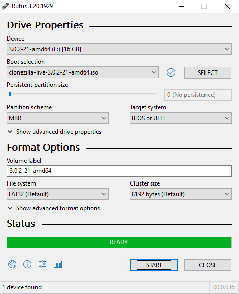](2022-11/zG4image.png)**

---

##### **2. Booting Clonezilla**

**Finding your Boot Menu**

You have to find your boot menu or change the boot priority to do this.

This part varies greatly since there are many different BIOS and yours will most likely look different than others

You can ask me for help in Discord, click [here](https://discord.com/users/451884726618423351) for my profile

One way you can find the Boot Menu is by looking at the startup screen of your PC

You may see some text that says **Press F11 for Boot Menu**

[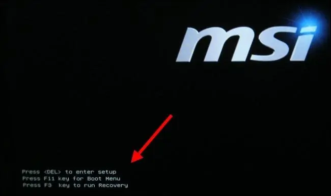](2022-11/z3mimage.png)  
Another way of finding the Boot Menu is in the BIOS

There is usually a key to access the BIOS, most of the time it is **F2** or **Del**

To access the BIOS, turn off your computer. Turn it on and repeatedly press the **F2** or **Del** key (or both if you want to) until a menu shows up.

Once you find it, your Boot Menu should look similar to this

[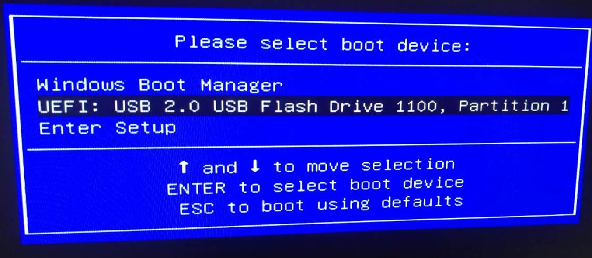](2022-11/3zfimage.png)

Look for your USB drive and press **Enter** to boot to it

##### **3. Using Clonezilla**  

When you boot to Clonezilla, you will see this

Press **Enter** or wait 30 seconds for it to automatically boot

[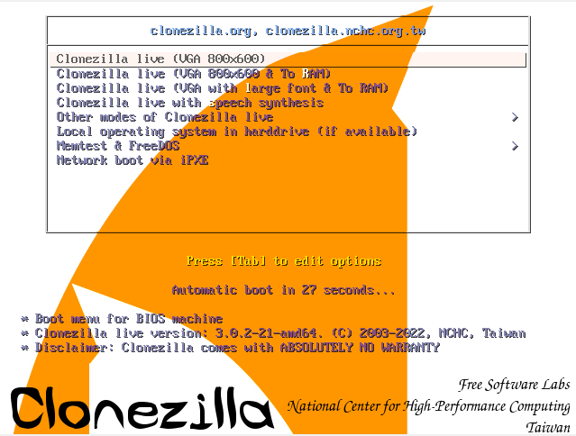](2022-11/Bnlimage.png)

Choose your language

[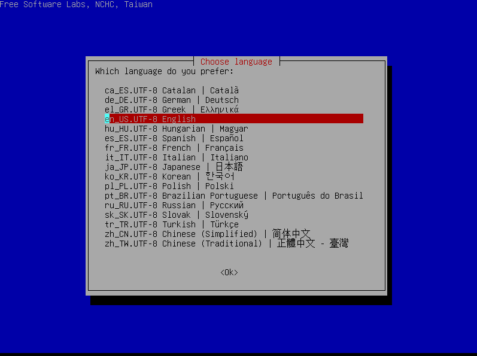](2022-11/yOTimage.png)

Press **Keep**

[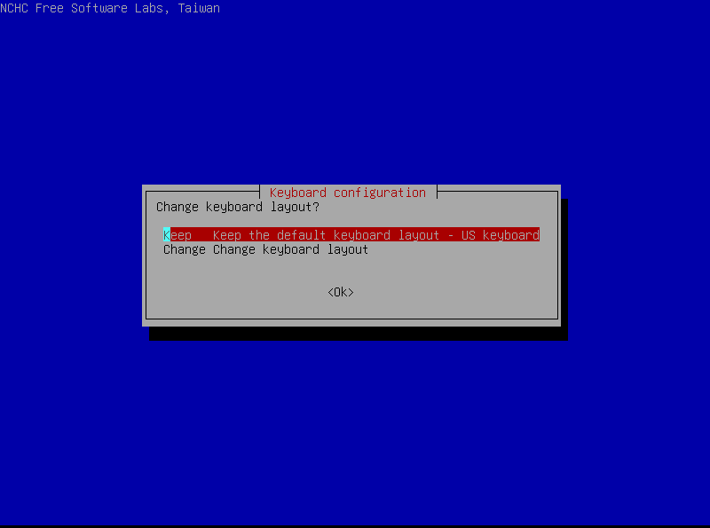](2022-11/kxQimage.png)

Press **Start Clonezilla**

[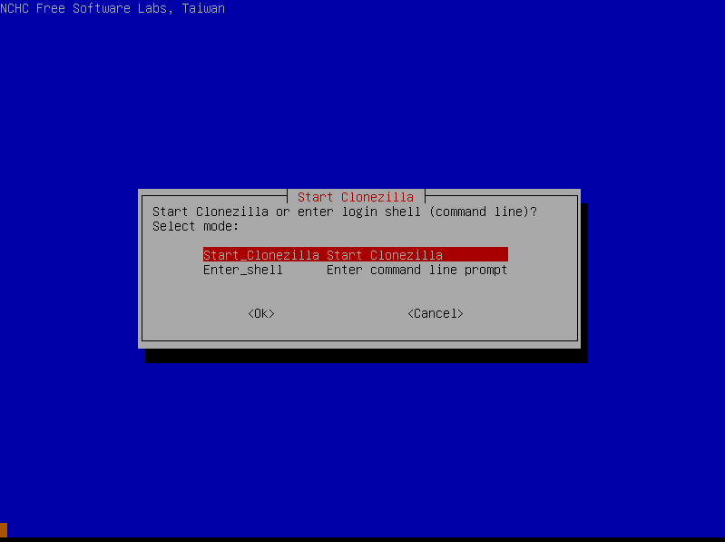](2022-11/Bc2image.png)

Choose **device-device**

[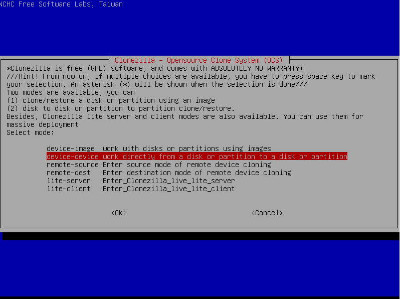](2022-11/4DLimage.png)

Press **Beginner**

[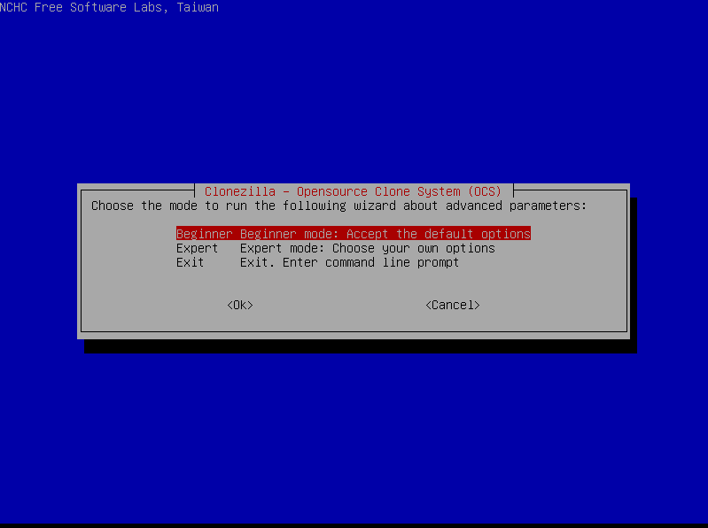](2022-11/8Eximage.png)

Press **disk\_to\_local\_disk**

[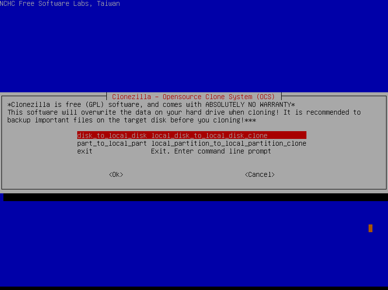](2022-11/GSsimage.png)

!!! Danger "WARNING"
    **This is very important, make sure you follow these steps closely as you can clone the wrong drive and lose data**

In this example, I am cloning a 20GB drive to a 30GB drive

First, you will choose the drive you are trying to clone which is the 20GB drive for me

[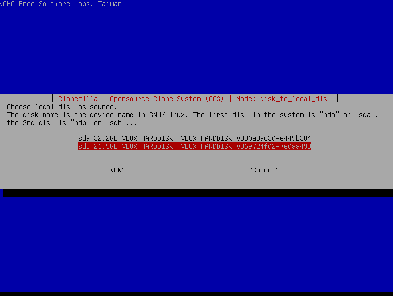](2022-11/x7Wimage.png)

Next, you will choose the drive that you want to clone to which is the 30GB drive for me

[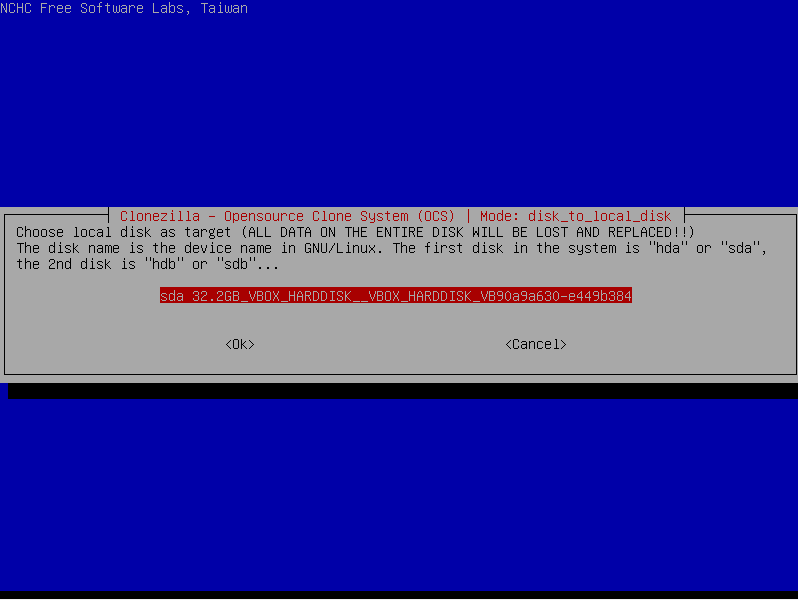](2022-11/N6uimage.png)

Press the **first** option (**-sfsck**)

[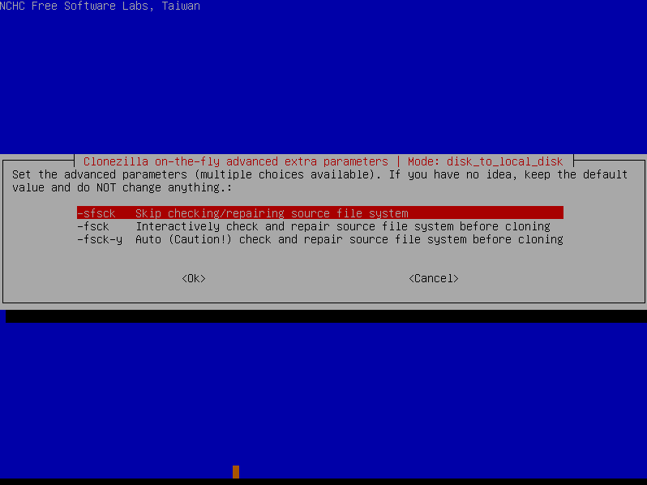](2022-11/tVnimage.png)

Press **-k0**

[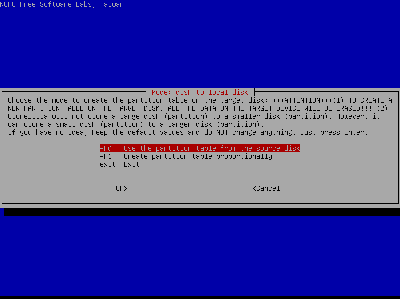](2022-11/CILimage.png)

Now you can choose to either reboot or shutdown when finished.

I'm going to choose shutdown

[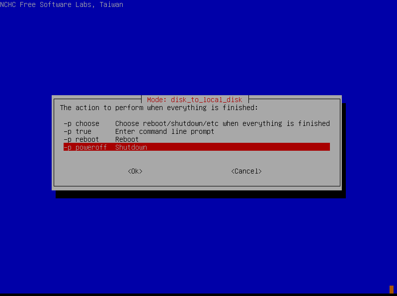](2022-11/UIwimage.png)

It will give you a message, just press **Enter**

[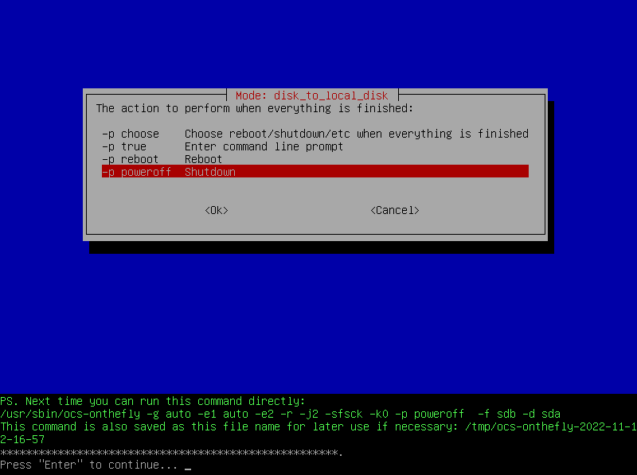](2022-11/ga8image.png)

It will warn you that the disk listed will be deleted

!!! Danger "WARNING"
    **Make sure it is the right disk (the disk you are cloning to)**

Type **Y** and press **Enter** to continue

[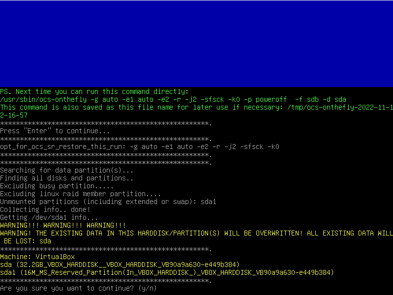](2022-11/j9iimage.png)  
It will tell you are you sure, just type **Y** again and press **Enter**

Now it is actually cloning the drive and will look like this, wait until it's done.

[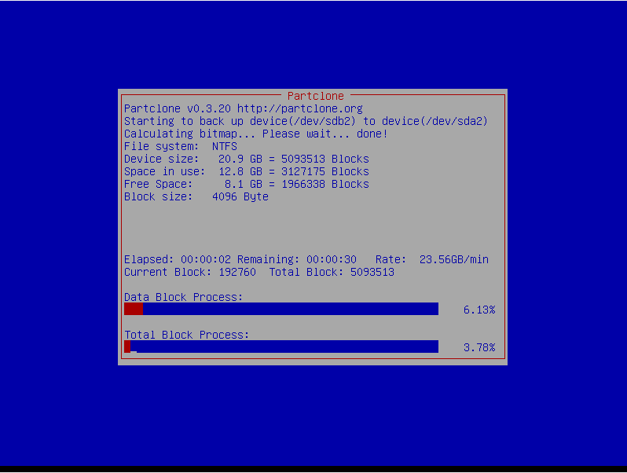](2022-11/RCOimage.png)

It may say this when it is finished, just press **Enter**

[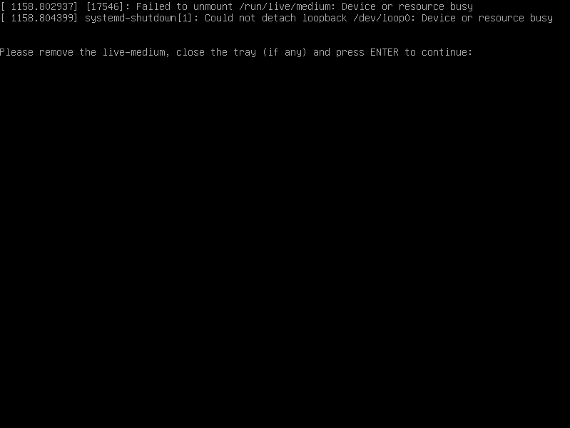](2022-11/07yimage.png)
