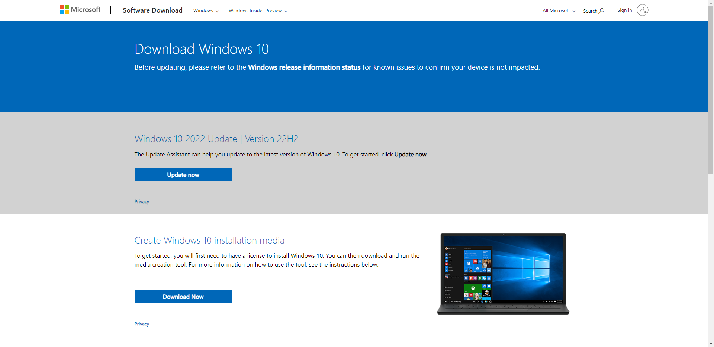
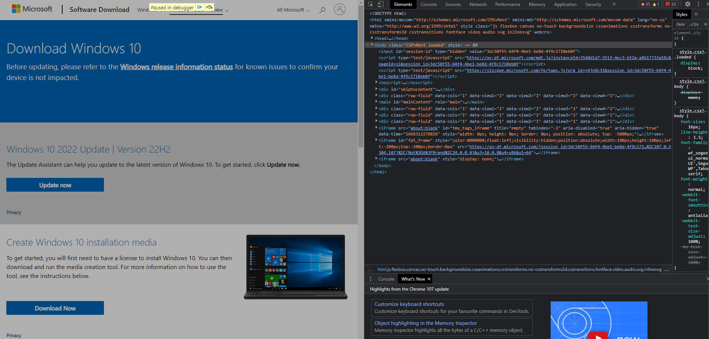
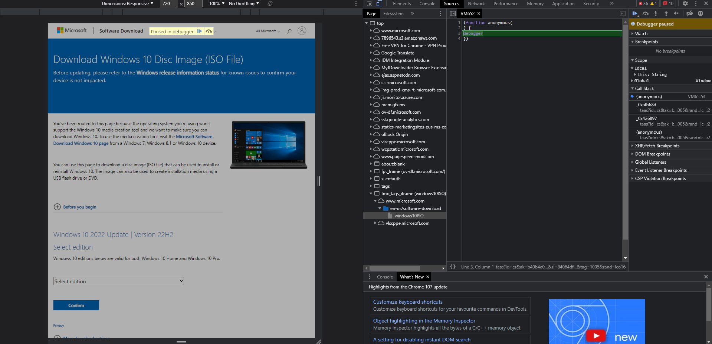
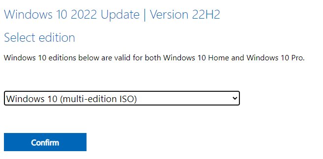
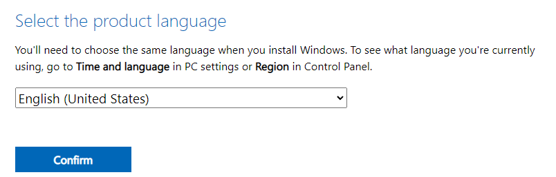
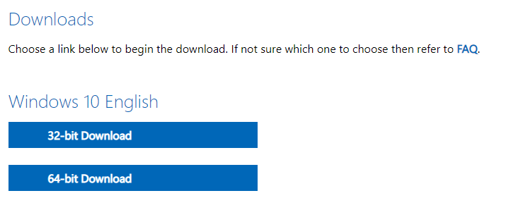

1. Go to https://www.microsoft.com/en-us/software-download/windows10

 
2. Open DevTools console by pressing Ctrl + Shift + I

 
3. On the top left of the DevTools console, you will see an icon of a phone and a tablet, click on it

 
4. Reload the page and now the website will look different

You can close DevTools now 
5. Go through the steps

 
Choose your language

 
Now you will see the download links
6. Choose the 64-bit download (You most likely don't need 32-bit)
