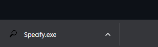
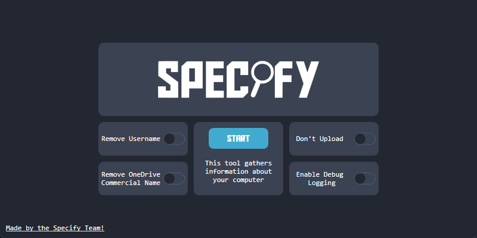

# How to Make a Snapshot with Specify 
***
**Source: https://github.com/Spec-ify/specify**
**Website: https://spec-ify.com/** 
!!! note "Note"
    Specify gathers info on your system that you may not want shared like your username (which can be hidden), installed programs, and running programs.
!!! note "Note"
	Snapshot will be deleted after 24 hours
***
# Installation
1. Download Specify from this link: https://github.com/Spec-ify/specify/releases/latest/download/Specify.exe 

 
2. Open it and you should see a menu 

!!! note "Note"
	Click **"Remove Username"** if you want to hide your Windows username 

{ align=left }
Click **Start**
 
3. After waiting a few seconds, it should open a website with your snapshot and also copy the link to your clipboard
{ align=left }
