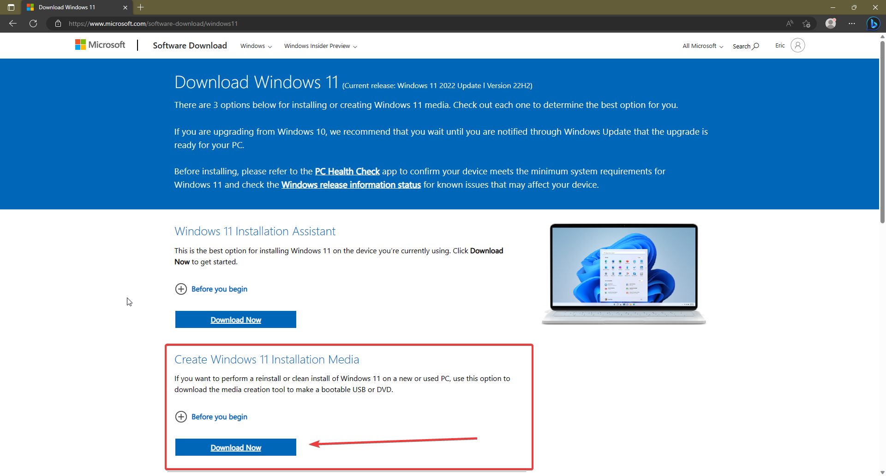

# Windows 11
## 1. Go to the [Windows 11 download page](https://www.microsoft.com/software-download/windows11)

## 2. Download the Installation Media Tool

## 3. Open it and Accept the terms of service

## 4. Press Next

!!! note "Note"
	If you don't want English, uncheck `"Use the recommended options for this PC"` and choose your language
## 5. Choose USB Flash Drive and press Next

## 