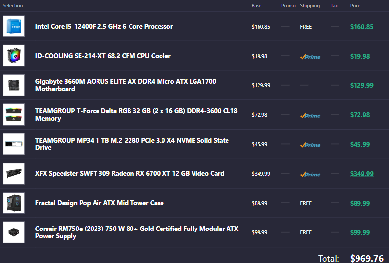
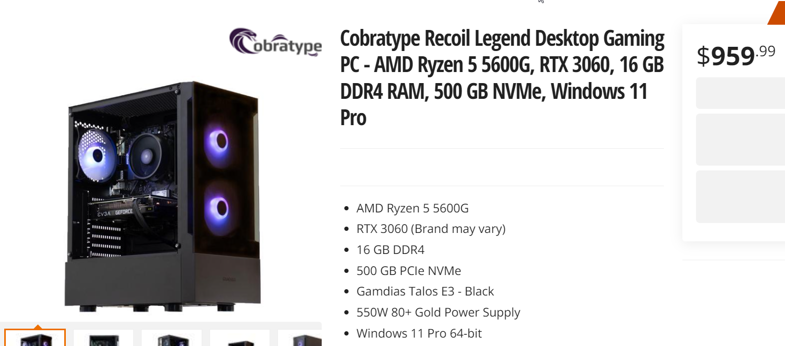

# Reasons why Prebuilts suck
***
# Control
You usually can't choose what parts you want. You are forced to either choose a small list of preselected parts or not pick at all and buy whatever parts come with the system. This could mean lower quality parts and bad part choices. (Ex. Single channel RAM, Bad cooling, cheap motherboard with a high end CPU)
 
# Upgradability
Most prebuilts (*especially made by OEMs like Dell, HP, Lenovo, Acer*) have very bad upgrade paths due to bad part choices or proprietary parts. This means that you have to spend more money to upgrade later on.
  
# Pricing
Prebuilts are usually priced very high compared to building a PC. (Ex. $1000 Prebuilt compared to a $700 built PC with higher quality parts. It's also very hard to find a decently priced prebuilt since 70% of them are not a good choice.
??? info "Custom PC vs Prebuilt"
	
	
	The custom PC comes with more storage, a faster GPU, and more quality parts in general. This also means you can get a custom PC that performs similar to the prebuilt but for cheaper.
  
# Transparency
Most prebuilts aren't very good at listing all the parts. They like to be vague like saying "750W PSU", they might not say the exact model to hide the fact that it's low quality. They might not even say what it has at all and you have to hope there aren't any problems. They also often don't list if the parts are proprietary or not. 
  
# Bloatware
Many prebuilts are paid to come with bloatware (Ex. McAfee, ads, OEM software). It is recommended to do a full reinstall when getting a new prebuilt.
 
# Other Reasons
- Hidden warranty sign-ups and monthly charges, e.g. Dell
- Upsell on peripherals
- Long hold times on customer support lines
- Proprietary case or motherboard form factors that make it nearly impossible to upgrade
- Warranty policy doesn't allow something as basic as XMP
- Hot glue used to hold cables or video cards in slots
- Needless 120mm water cooling that isn't even good just to say it's water cooled
- Single-stick memory, especially in systems using APUs
- Combinations of hardware that make no sense, e.g. 1000W PSU with parts that use 450W max
- Too much budget spent on RAM (3.g. 32GB or 64GB systems with a 1650 and R3 3100)
- Dumping old systems for way too much money, like Corsair's $1000 One with an i7-7700 and GTX 1070
- Lead times on GPUs, despite the listing otherwise appearing as "in-stock." This will make you think you're getting it sooner than you are.
- *not even shipping you the right system*
